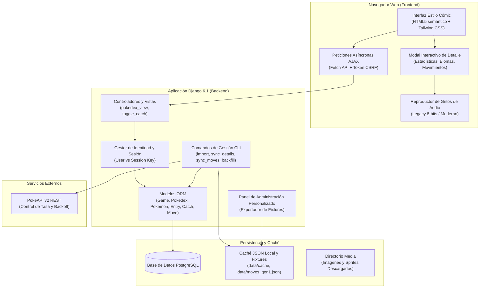

# 🔴 Pokédex Global Tracker ⚪ (Español)

[](https://www.djangoproject.com/)
[](https://www.python.org/)
[](https://www.postgresql.org/)
[](https://tailwindcss.com/)
[](https://opensource.org/licenses/MIT)

> **Idiomas disponibles:**  
> 🇬🇧 [English Version (README Principal)](README.md)  
> 🇪🇸 **Español (Este documento)**

---

## 📖 Descripción General

**Pokédex Global Tracker** es una plataforma web completa desarrollada con **Django 6.1.1** y **PostgreSQL**, diseñada para coleccionistas, entrenadores y entusiastas que desean registrar y monitorear su progreso de captura de Pokémon a través de todas las generaciones de videojuegos (desde la 1ª Generación en Rojo, Azul y Amarillo, hasta la 9ª Generación en Escarlata y Púrpura).

### 🌟 Características Principales:
- **Fidelidad Canónica e Histórica**: Muestra los tipos elementales exactos según la generación del cartucho (ej: Magnemite es únicamente Eléctrico en 1ª Generación y Eléctrico/Acero a partir de la 2ª Generación; Clefairy y Jigglypuff son de tipo Normal en Generaciones 1 a 5, adquiriendo el tipo Hada a partir de la 6ª Generación).
- **Inmersión Sonora Retro y Moderna**: Sistema de reproducción de gritos de audio inteligente: reproduce el sonido clásico en 8 bits (sonido chiptune nostálgico) en juegos de Generaciones 1 a 5, y el sonido orquestado moderno para entregas en 3D (Gen 6+).
- **Interfaz Gráfica Estilo Cómic / Manga**: Tarjetas con efecto cómic retro, bordes marcados, sombras sólidas, tramas de puntos y un modal dinámico que expone estadísticas de combate, biomas, métodos de obtención específicos del cartucho, catálogo de movimientos y descripciones oficiales en español.
- **Seguimiento de Capturas en Tiempo Real**: Marcado instantáneo mediante AJAX con cero recargas de página. Compatible con usuarios registrados (vinculado a su cuenta) y visitantes anónimos (vinculado a su clave de sesión en cookies).
- **Ingesta Resiliente de PokeAPI**: Comandos CLI avanzados con soporte de *Offline-First*, reintentos automáticos con retroceso exponencial (*exponential backoff*), adición de variación aleatoria (*jitter*), retardos de cortesía y multiprocesamiento multihilo.
- **Herramientas de Exportación y Respaldo**: Sistema integrado en el panel de administración para generar y restaurar fixtures JSON en UTF-8 con un solo clic.

---

## 🏗️ Arquitectura del Sistema



---

## ⚡ Requisitos del Sistema

- **Python**: 3.12 o superior.
- **PostgreSQL**: 14 o superior (recomendado 16+).
- **Git**: Sistema de control de versiones.
- **Navegador Web Moderno**: Chrome, Firefox, Edge o Safari con soporte de JavaScript moderno y Audio API.

---

## 🚀 Guía de Instalación y Puesta en Marcha

### 1. Clonar el Repositorio
```bash
git clone https://github.com/Gatozo/pokedexglobal.git
cd pokedexglobal
```

### 2. Configurar el Entorno Virtual

**En Windows (PowerShell):**
```powershell
python -m venv .venv
.\.venv\Scripts\Activate.ps1
```

*(Si PowerShell impide ejecutar scripts por política de seguridad, ejecuta: `Set-ExecutionPolicy -ExecutionPolicy RemoteSigned -Scope Process`)*

**En Linux / macOS:**
```bash
python3 -m venv .venv
source .venv/bin/activate
```

### 3. Instalar las Dependencias
```bash
python -m pip install --upgrade pip
pip install -r requirements.txt
```

### 4. Configurar la Base de Datos PostgreSQL
Inicia sesión en PostgreSQL (por ejemplo, con la consola `psql`):
```sql
CREATE DATABASE pokedex_db;
CREATE USER postgres WITH ENCRYPTED PASSWORD 'tu_password';
GRANT ALL PRIVILEGES ON DATABASE pokedex_db TO postgres;
```

### 5. Configurar Variables de Entorno
Crea el archivo `.env` a partir de `.env.example`:

**Windows (PowerShell):**
```powershell
Copy-Item .env.example .env
```

**Linux / macOS:**
```bash
cp .env.example .env
```

Edita `.env` con los valores de conexión a tu base de datos:
```ini
DB_NAME=pokedex_db
DB_USER=postgres
DB_PASSWORD=tu_password
DB_HOST=localhost
DB_PORT=5432
```

### 6. Ejecutar Migraciones de Base de Datos
```bash
python manage.py migrate
```

### 7. Crear Usuario Administrador
```bash
python manage.py createsuperuser
```
Ingresa el nombre de usuario, correo electrónico y contraseña deseados.

---

## 📥 Poblamiento de Datos (Comandos de Gestión)

El proyecto cuenta con múltiples comandos especializados para inicializar y mantener la base de datos sincronizada:

### Opción A: Carga Instantánea desde Fixtures (Recomendada)
Si ya cuentas con el archivo de respaldo incluido en el repositorio:
```bash
python manage.py loaddata tracker/fixtures/pokedex_entries.json
```

### Opción B: Ingesta Completa desde PokeAPI

1. **Importar Juego y Pokédex Regional**:
   ```bash
   # Generación 1: Pokémon Rojo
   python manage.py import_pokedex --game red --generation 1 --pokedex kanto --workers 4

   # Generación 1: Pokémon Azul
   python manage.py import_pokedex --game blue --generation 1 --pokedex kanto --workers 4

   # Generación 1: Pokémon Amarillo
   python manage.py import_pokedex --game yellow --generation 1 --pokedex kanto --workers 4
   ```

2. **Sincronizar Catálogo Oficial de Movimientos**:
   ```bash
   # Descarga o carga local de los 165 movimientos de Gen 1
   python manage.py sync_moves --generation 1 --local
   ```

3. **Sincronizar Detalles de Juego, Encuentros y Textos de Pokédex**:
   ```bash
   python manage.py sync_pokemon_details --game red --workers 5
   ```

4. **Verificación y Corrección de Tipos Históricos**:
   ```bash
   python manage.py backfill_pokedex_types
   ```

---

## 💻 Ejecución del Servidor

Inicia el servidor de desarrollo integrado de Django:
```bash
python manage.py runserver 127.0.0.1:8000
```

Accede desde tu navegador web:
- **Página Principal del Tracker**: [http://127.0.0.1:8000/](http://127.0.0.1:8000/)
- **Vista de Pokédex Roja / Kanto**: [http://127.0.0.1:8000/red/kanto/](http://127.0.0.1:8000/red/kanto/)
- **Panel Administrativo**: [http://127.0.0.1:8000/admin/](http://127.0.0.1:8000/admin/)

---

## 🧪 Ejecución de Pruebas Unitarias

Para comprobar el correcto funcionamiento de toda la suite de pruebas:
```bash
python manage.py test
```

Verás la ejecución de las 20 pruebas unitarias y de integración que validan:
- Respuesta de vistas y códigos de estado HTTP 200.
- Filtrado y serialización de Pokémon capturados para usuarios autenticados y sesiones anónimas.
- Alternancia de estado (*toggle catch*) y recálculo porcentual inmediato vía AJAX.
- Caída en cascada idiomática (*locale fallback*: Español -> Inglés -> Clave por defecto).
- Preservación de tipos históricos según la generación seleccionada.
- Protección de campos marcados con `is_custom_override`.

---

## 🛠️ Panel de Administración y Respaldos

El panel de administración de Django (`/admin/`) ha sido extendido con herramientas exclusivas:
1. **Protección de Ediciones Manuales (`is_custom_override`)**: Permite ajustar textos, métodos de obtención o tipos directamente desde el formulario web sin que las sincronizaciones periódicas con PokeAPI los sobreescriban.
2. **Generador de Respaldo de Fixtures**: Los superusuarios disponen de un botón directo en el encabezado del panel para volcar toda la base de datos estructural a `tracker/fixtures/pokedex_entries.json` en codificación UTF-8, facilitando el control de versiones con Git.

---

## 📚 Documentación Técnica Detallada

Para profundizar en cada subsistema, consulta los documentos de la carpeta `docs/es/`:
- [Índice de Documentación en Español](docs/es/README.md)
  - [Arquitectura y Flujo de Información](docs/es/arquitectura.md)
  - [Modelos de Datos y Relaciones](docs/es/modelos-de-datos.md)
  - [Manual de Comandos de Gestión](docs/es/comandos-de-gestion.md)
  - [Endpoints de API y Vistas](docs/es/api-y-endpoints.md)
  - [Diseño Visual y Componentes Cómic](docs/es/interfaz-y-componentes.md)
  - [Administración y Sistema de Fixtures](docs/es/administracion-y-fixtures.md)
  - [Guía de Pruebas y Calidad de Software](docs/es/guia-de-pruebas.md)

---

## 📄 Licencia

Este proyecto se distribuye bajo los términos de la Licencia MIT.
