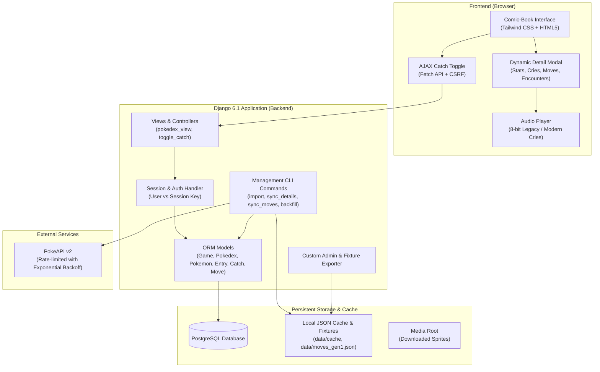

# 🔴 Pokédex Global Tracker ⚪

[](https://www.djangoproject.com/)
[](https://www.python.org/)
[](https://www.postgresql.org/)
[](https://tailwindcss.com/)
[](https://opensource.org/licenses/MIT)

> **Language / Idioma:**  
> 🇬🇧 **[English Documentation](#english-version)** (Primary)  
> 🇪🇸 **[Documentación en Español](#versión-en-español)** | [README en Español (Archivo Dedicado)](README.es.md)

---

<a name="english-version"></a>
# 🇬🇧 English Version

## 📖 Overview

**Pokédex Global Tracker** is a full-featured web application built with **Django 6.1.1** and **PostgreSQL** designed to track Pokémon catching progress across multiple video game generations (from Generation I Red/Blue/Yellow up to Generation IX Scarlet/Violet).

The application features:
- **Generation-Accurate Data**: Displays historical Pokémon typings according to the game generation (e.g. Magnemite is pure Electric in Gen 1, Electric/Steel in Gen 2+; Clefairy is Normal in Gen 1-5, Fairy in Gen 6+).
- **Authentic Retro Experience**: Dynamic 8-bit cries for retro generations (Gen 1 to 5) vs modern cries (Gen 6+), retro sprites and cover styling.
- **Comic-Book UI Design**: Interactive comic-panel modal with stat cards, Spanish descriptions, official localizations, and live capture toggling.
- **Dual Catch Tracking**: Real-time AJAX-powered catch toggle with seamless support for both anonymous guests (session-based) and authenticated users.
- **Resilient Data Ingestion**: Offline-first PokeAPI crawler with rate-limiting, exponential backoff, jitter, concurrent threading, and fixture export/import tools.

---

## 🏗️ Architecture Overview



---

## ⚡ Prerequisites

Before installing the project, verify that your machine has the following dependencies installed:

1. **Python**: Version `3.12` or higher (verified with Python 3.12 / 3.13).
2. **PostgreSQL**: Version `14` or higher (PostgreSQL 16+ recommended).
3. **Git**: For version control.
4. **Virtual Environment module**: `venv` (standard in Python).

---

## 🚀 Step-by-Step Installation

### Step 1: Clone the Repository
```bash
git clone https://github.com/Gatozo/pokedexglobal.git
cd pokedexglobal
```

### Step 2: Create and Activate a Virtual Environment

**On Windows (PowerShell):**
```powershell
python -m venv .venv
.\.venv\Scripts\Activate.ps1
```

*(If script execution is disabled in PowerShell, run: `Set-ExecutionPolicy -ExecutionPolicy RemoteSigned -Scope Process`)*

**On Linux / macOS:**
```bash
python3 -m venv .venv
source .venv/bin/activate
```

### Step 3: Install Dependencies
```bash
python -m pip install --upgrade pip
pip install -r requirements.txt
```

> **Installed Core Packages:**
> - `Django>=6.1.1,<6.2`
> - `psycopg[binary]>=3.3.5` (Modern PostgreSQL adapter for Python 3 & Django 6)
> - `python-dotenv>=1.2.3` (Loads `.env` configuration)
> - `requests>=2.31.0` (HTTP client with retry capabilities)

### Step 4: Configure PostgreSQL Database

1. Open your PostgreSQL console (`psql`) or pgAdmin:
```sql
CREATE DATABASE pokedex_db;
CREATE USER postgres WITH ENCRYPTED PASSWORD 'postgres';
GRANT ALL PRIVILEGES ON DATABASE pokedex_db TO postgres;
```

### Step 5: Configure Environment Variables

Copy `.env.example` into `.env`:

**Windows (PowerShell):**
```powershell
Copy-Item .env.example .env
```

**Linux / macOS:**
```bash
cp .env.example .env
```

Edit `.env` to match your local database credentials:
```ini
# PostgreSQL Database Settings
DB_NAME=pokedex_db
DB_USER=postgres
DB_PASSWORD=your_secure_password
DB_HOST=localhost
DB_PORT=5432
```

### Step 6: Apply Database Migrations
```bash
python manage.py migrate
```

### Step 7: Create an Administrator Account
```bash
python manage.py createsuperuser
```
Follow the interactive prompts to set username, email, and password.

---

## 📦 Data Ingestion & Management Commands

The system contains an automated ingestion pipeline to populate games, Pokédex entries, historical typings, moves, and flavor text.

### 1. Quick Load from Pre-packaged Fixtures (Fastest)
If you already have pre-packaged fixtures, load them directly into PostgreSQL:
```bash
python manage.py loaddata tracker/fixtures/pokedex_entries.json
```

### 2. Import Game and Pokédex from PokeAPI
To download a game and its regional Pokédex from scratch:
```bash
# Import Pokémon Red (Generation 1, Kanto Regional Pokédex)
python manage.py import_pokedex --game red --generation 1 --pokedex kanto --workers 4

# Import Pokémon Blue
python manage.py import_pokedex --game blue --generation 1 --pokedex kanto --workers 4

# Import Pokémon Yellow
python manage.py import_pokedex --game yellow --generation 1 --pokedex kanto --workers 4
```

### 3. Synchronize Move Catalogues
Download or update official moves with Spanish translations, power, accuracy, and PP:
```bash
# Sync Generation 1 moves (uses local data/moves_gen1.json when available)
python manage.py sync_moves --generation 1 --local
```

### 4. Synchronize Detailed Data (Encounters, Biomes, Stats)
Enrich entries with generation-specific data, wild encounter zones, and Spanish flavor texts:
```bash
python manage.py sync_pokemon_details --game red --workers 5
```

### 5. Historical Typings Backfill
Ensure all Pokédex entries respect the typings of their respective generation:
```bash
python manage.py backfill_pokedex_types
```

---

## 💻 Running the Application

### Start Development Server
```bash
python manage.py runserver 127.0.0.1:8000
```

Open your browser and navigate to:
- **Main Pokédex Interface**: [http://127.0.0.1:8000/](http://127.0.0.1:8000/)
- **Specific Game / Dex**: [http://127.0.0.1:8000/red/kanto/](http://127.0.0.1:8000/red/kanto/)
- **Django Admin Portal**: [http://127.0.0.1:8000/admin/](http://127.0.0.1:8000/admin/)

---

## 🧪 Running Automated Tests

The project includes an automated test suite covering models, views, AJAX catch toggling, historical type fallbacks, and multi-user sessions:

```bash
python manage.py test
```

Expected output:
```text
Creating test database for alias 'default'...
....................
----------------------------------------------------------------------
Ran 20 tests in ~4.4s

OK
Destroying test database for alias 'default'...
```

---

## 🛠️ Django Admin Features & Backup System

The Django Admin (`/admin/`) includes tailored features:
- **Custom Overrides Protection (`is_custom_override`)**: Allows administrators to manually edit obtaining methods or texts without risk of automated sync commands overwriting custom edits.
- **One-Click Fixture Backup**: Superusers have a direct dashboard button in the admin interface to export structural data (`Game`, `Pokedex`, `PokedexEntry`) directly into `tracker/fixtures/pokedex_entries.json` with UTF-8 encoding.

---

## 📁 Repository Structure

```text
pokedexglobal/
├── manage.py                     # Django CLI management entrypoint
├── requirements.txt              # Core python package dependencies
├── .env.example                  # Environment variable configuration template
├── pokedex/                      # Django project configuration module
│   ├── settings.py               # Application settings, DB, static, and media
│   ├── urls.py                   # Root URL dispatcher
│   ├── wsgi.py / asgi.py         # Deployment gateways
├── tracker/                      # Core Pokédex tracker application
│   ├── admin.py                  # Admin configuration and fixture export integration
│   ├── models.py                 # ORM models (Game, Pokedex, Pokemon, Entry, Catch, Move)
│   ├── views.py                  # HTTP request handlers & AJAX endpoints
│   ├── urls.py                   # Tracker app routing
│   ├── utils.py                  # Helper functions (PokeAPI caching, exponential backoff)
│   ├── fixtures_util.py          # Fixture dumping and metadata analysis utilities
│   ├── tests.py                  # Automated test suite (20 unit/integration tests)
│   ├── data/                     # Offline JSON data files and move dictionaries
│   ├── fixtures/                 # Seed JSON fixtures for database loading
│   ├── management/commands/      # Custom manage.py CLI commands
│   │   ├── import_pokedex.py
│   │   ├── sync_pokemon_cache.py
│   │   ├── sync_pokemon_details.py
│   │   ├── sync_moves.py
│   │   └── backfill_pokedex_types.py
│   └── templates/tracker/        # Comic-style responsive frontend templates
└── docs/                         # Detailed architecture and API documentation
    ├── en/                       # English documentation
    └── es/                       # Spanish documentation
```

---

## 📚 Further Documentation

For in-depth explanations of specific system modules, see:
- [English Documentation Index](docs/en/README.md)
  - [Architecture & Design](docs/en/architecture.md)
  - [Database Models & Schemas](docs/en/database-models.md)
  - [Management Commands Reference](docs/en/management-commands.md)
  - [API Endpoints & Views](docs/en/api-and-endpoints.md)
  - [UI & Comic-Book Component Design](docs/en/ui-and-components.md)
  - [Admin Customizations & Fixtures](docs/en/admin-and-fixtures.md)
  - [Testing Guide & Quality Assurance](docs/en/testing-guide.md)

---

<a name="versión-en-español"></a>
# 🇪🇸 Versión en Español

## 📖 Descripción General

**Pokédex Global Tracker** es una aplicación web integral desarrollada con **Django 6.1.1** y **PostgreSQL**, diseñada para llevar el seguimiento y control de capturas de Pokémon a lo largo de las distintas generaciones de videojuegos (desde la 1ª Generación Rojo/Azul/Amarillo hasta la 9ª Generación Escarlata/Púrpura).

### Características Destacadas:
- **Fidelidad Histórica por Generación**: Respeta los tipos originales según la generación del juego (ej: Magnemite es únicamente Eléctrico en Gen 1 y Eléctrico/Acero desde Gen 2; Clefairy es Normal de Gen 1 a 5 y Hada desde Gen 6).
- **Experiencia Retro Auténtica**: Reproducción dinámica de gritos clásicos en 8 bits para juegos retro (Generaciones 1 a 5) y gritos modernos para juegos 3D (Gen 6+), además de sprites retro y temas visuales por cartucho.
- **Interfaz Estilo Cómic**: Modal interactivo ilustrado con paneles de cómic que detalla estadísticas, biomas, métodos de obtención en el cartucho seleccionado, movimientos y descripciones oficiales en español.
- **Doble Modalidad de Seguimiento**: Marcado de capturas mediante AJAX en tiempo real tanto para usuarios anónimos (basado en sesiones de navegador) como para usuarios autenticados.
- **Sincronización Resiliente**: Descarga y procesamiento inteligente desde PokeAPI con control de tasa de peticiones (*rate-limiting*), reintentos con retroceso exponencial (*exponential backoff*), hilos concurrentes y herramientas de importación/exportación de respaldos (*fixtures*).

---

## ⚡ Requisitos Previos

1. **Python**: Versión `3.12` o superior.
2. **PostgreSQL**: Versión `14` o superior (se recomienda 16+).
3. **Git**: Para el clonado y gestión de versiones.
4. **Módulo venv**: Incluido de forma nativa en la instalación de Python.

---

## 🚀 Instalación Paso a Paso

### Paso 1: Clonar el Repositorio
```bash
git clone https://github.com/Gatozo/pokedexglobal.git
cd pokedexglobal
```

### Paso 2: Crear y Activar el Entorno Virtual

**En Windows (PowerShell):**
```powershell
python -m venv .venv
.\.venv\Scripts\Activate.ps1
```

*(Si PowerShell bloquea la ejecución de scripts, ejecuta: `Set-ExecutionPolicy -ExecutionPolicy RemoteSigned -Scope Process`)*

**En Linux / macOS:**
```bash
python3 -m venv .venv
source .venv/bin/activate
```

### Paso 3: Instalar Dependencias
```bash
python -m pip install --upgrade pip
pip install -r requirements.txt
```

### Paso 4: Configurar la Base de Datos PostgreSQL

Accede a tu gestor de PostgreSQL (`psql` o pgAdmin) y ejecuta:
```sql
CREATE DATABASE pokedex_db;
CREATE USER postgres WITH ENCRYPTED PASSWORD 'postgres';
GRANT ALL PRIVILEGES ON DATABASE pokedex_db TO postgres;
```

### Paso 5: Configurar las Variables de Entorno

Copia la plantilla `.env.example` en un nuevo archivo `.env`:

**Windows (PowerShell):**
```powershell
Copy-Item .env.example .env
```

**Linux / macOS:**
```bash
cp .env.example .env
```

Edita el archivo `.env` con las credenciales de tu PostgreSQL local:
```ini
# Configuración de Base de Datos PostgreSQL
DB_NAME=pokedex_db
DB_USER=postgres
DB_PASSWORD=tu_password_aqui
DB_HOST=localhost
DB_PORT=5432
```

### Paso 6: Ejecutar las Migraciones
```bash
python manage.py migrate
```

### Paso 7: Crear Superusuario Administrador
```bash
python manage.py createsuperuser
```

---

## 📦 Ingesta de Datos y Comandos de Gestión

### 1. Carga Rápida desde Fixtures (Recomendado para inicio rápido)
Si dispones de fixtures preexistentes, cárgalos directamente:
```bash
python manage.py loaddata tracker/fixtures/pokedex_entries.json
```

### 2. Importar Pokédex desde PokeAPI
```bash
# Importar Pokémon Rojo (Generación 1, Pokédex de Kanto)
python manage.py import_pokedex --game red --generation 1 --pokedex kanto --workers 4

# Importar Pokémon Azul
python manage.py import_pokedex --game blue --generation 1 --pokedex kanto --workers 4

# Importar Pokémon Amarillo
python manage.py import_pokedex --game yellow --generation 1 --pokedex kanto --workers 4
```

### 3. Sincronizar Catálogo de Movimientos
```bash
python manage.py sync_moves --generation 1 --local
```

### 4. Sincronizar Detalles, Encuentros y Textos
```bash
python manage.py sync_pokemon_details --game red --workers 5
```

### 5. Actualización de Tipos Históricos
```bash
python manage.py backfill_pokedex_types
```

---

## 💻 Ejecución del Servidor de Desarrollo

Inicia el servidor local de Django:
```bash
python manage.py runserver 127.0.0.1:8000
```

Visita en tu navegador:
- **Pokédex Principal**: [http://127.0.0.1:8000/](http://127.0.0.1:8000/)
- **Juego Específico**: [http://127.0.0.1:8000/red/kanto/](http://127.0.0.1:8000/red/kanto/)
- **Panel de Administración**: [http://127.0.0.1:8000/admin/](http://127.0.0.1:8000/admin/)

---

## 🧪 Ejecución de Pruebas Unitarias

Para verificar la integridad del sistema:
```bash
python manage.py test
```

Se validarán las 20 pruebas de modelos, vistas, endpoints AJAX, retroceso de tipos y control de sesiones.

---

## 📚 Documentación Técnica Detallada

Para consultar la documentación técnica especializada por módulo:
- [Índice de Documentación en Español](docs/es/README.md)
  - [Arquitectura y Diseño](docs/es/arquitectura.md)
  - [Modelos de Base de Datos y Esquemas](docs/es/modelos-de-datos.md)
  - [Referencia de Comandos de Gestión](docs/es/comandos-de-gestion.md)
  - [Endpoints de API y Vistas](docs/es/api-y-endpoints.md)
  - [Diseño de Interfaz Estilo Cómic](docs/es/interfaz-y-componentes.md)
  - [Personalización del Administrador y Fixtures](docs/es/administracion-y-fixtures.md)
  - [Guía de Pruebas y Aseguramiento de Calidad](docs/es/guia-de-pruebas.md)

---

## 📄 Licencia

Este proyecto está bajo la Licencia MIT.
