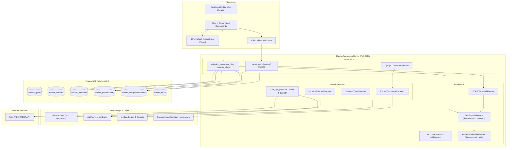
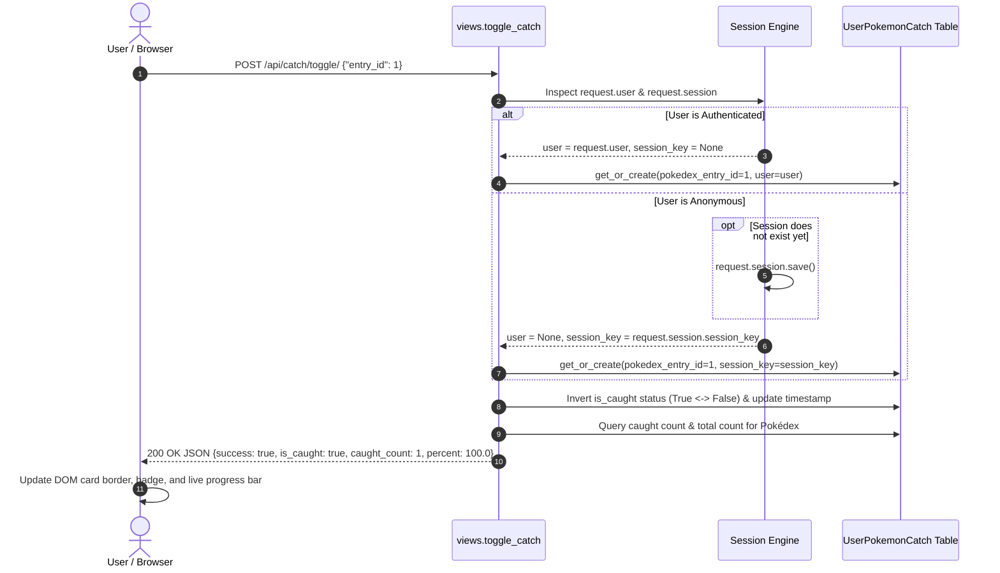

# 🏛️ Architecture & System Design (English)

## 1. System Overview

**Pokédex Global Tracker** is engineered as a monolithic Django application designed for high read performance, resilient offline-first data caching, and responsive frontend interaction. The project separates concerns into well-defined layers:

1. **Presentation Layer (Frontend)**: Semantic HTML5 templates styled with Tailwind CSS, leveraging custom CSS classes for a retro comic-strip style. Client-side state is handled through vanilla JavaScript using the Fetch API and modern Audio APIs.
2. **Application & Routing Layer**: Django URL routing dispatching to functional views (`pokedex_view`) and JSON API endpoints (`toggle_catch`).
3. **Domain & Data Layer**: Django ORM models mapping to a PostgreSQL relational database with JSONField payloads for flexible external metadata storage.
4. **Data Ingestion & CLI Pipeline**: Multi-threaded, rate-limited management commands that crawl, normalize, and ingest data from PokeAPI v2 into local cache files and relational tables.

---

## 2. Component Architecture Diagram

---

## 3. Data Flow & Catch Tracking Lifecycle

### 3.1 Dual-Identity Catch Tracking (Guest vs Authenticated)
A core architectural requirement of the application is enabling visitors to mark Pokémon as caught immediately without requiring registration, while preserving their progress across page navigation, and seamlessly supporting authenticated users.

This is achieved through `_get_user_or_session(request)`:

### 3.2 Offline-First Data Ingestion Strategy
To prevent IP bans from PokeAPI and guarantee deterministic offline development, all data synchronization commands adhere to a **Store-and-Verify** pattern:
1. **Local JSON Cache**: All HTTP calls to PokeAPI store responses under `tracker/data/cache/` keyed by URL digest or entity ID.
2. **Pacing Delays & Exponential Backoff**: The custom `safe_api_get` utility incorporates a polite delay (0.05s default), detects HTTP 429 status codes, respects `Retry-After` headers, and falls back to randomized exponential backoff ($base\_delay \times 2^{attempt} + \text{jitter}$).
3. **Custom Override Protection**: The `is_custom_override` boolean flag on `PokedexEntry` guarantees that manually curated community data (special encounter locations, customized flavor texts) will never be overwritten during re-synchronizations.

---

## 4. Key Performance Optimizations

1. **Select Related Queries**: In `pokedex_view`, entries are queried with `.select_related("pokemon")` to eliminate $N+1$ database query overhead.
2. **Bulk ID Set In-Memory Lookup**: User catches are fetched in a single flat list query (`values_list('pokedex_entry_id', flat=True)`), transformed into a Python `set`, allowing $O(1)$ constant-time lookup when annotating cards.
3. **Database Indexing**: Compound indexes on `[pokedex, entry_number]`, `[user, pokedex_entry]`, and `[session_key, pokedex_entry]` guarantee sub-millisecond lookups under high concurrency.
