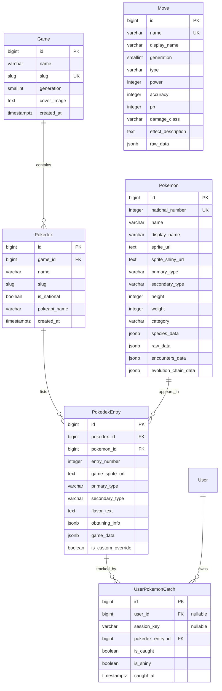

# 🗄️ Database Models & Schema Specification (English)

## 1. Entity-Relationship Diagram

---

## 2. Models Specification

### 2.1 `Game`
Represents an official Pokémon video game title release.

- **Table Name**: `tracker_game`
- **Fields**:
  - `id`: Auto-incrementing primary key.
  - `name`: Official title (e.g. `"Pokémon Red"`).
  - `slug`: Unique slug identifier (e.g. `"red"`, `"blue"`, `"firered"`).
  - `generation`: Integer generation number (1 through 9).
  - `cover_image`: URL to high-resolution box art.
  - `created_at`: Creation timestamp.
- **Key Properties**:
  - `display_name`: Resolves the canonical localized Spanish name (fallback cascade: `GAME_NAMES_ES` mapping -> `name` -> PokeAPI version localized text -> formatted slug).
  - `has_retro_sprites`: Returns `True` if `generation <= 5` (signaling 2D pixel-art sprites rather than modern 3D renders).

---

### 2.2 `Pokedex`
Represents an in-game Pokédex directory within a specific game (e.g. Kanto Regional Pokédex, Johto Pokédex, National Pokédex).

- **Table Name**: `tracker_pokedex`
- **Fields**:
  - `id`: Auto-incrementing primary key.
  - `game`: Foreign Key to `Game` (on delete cascade, related name `pokedexes`).
  - `name`: Human-readable name (e.g. `"Pokédex Regional de Kanto"`).
  - `slug`: Slug unique within the game (`kanto`, `national`).
  - `is_national`: Boolean flag indicating if this is the comprehensive National Pokédex.
  - `pokeapi_name`: PokeAPI resource slug identifier (e.g. `"kanto"`, `"original-sinnoh"`).
  - `created_at`: Creation timestamp.
- **Constraints**:
  - `unique_together = ('game', 'slug')`.

---

### 2.3 `Pokemon`
Represents a species in the universal National Pokédex, holding core biographical, asset, and raw PokeAPI response data.

- **Table Name**: `tracker_pokemon`
- **Fields**:
  - `id`: Primary key.
  - `national_number`: Unique National Dex number (`1` for Bulbasaur, `151` for Mew, etc.). Indexed.
  - `name`: Lowercase canonical slug name (`"bulbasaur"`).
  - `display_name`: Formatted or localized display name (`"Bulbasaur"`).
  - `sprite_url`: URL to official modern artwork / standard sprite.
  - `sprite_shiny_url`: URL to shiny variant sprite.
  - `primary_type`: Canonical modern primary type (`"grass"`).
  - `secondary_type`: Canonical modern secondary type (nullable, `"poison"`).
  - `height`: Height in decimeters.
  - `weight`: Weight in hectograms.
  - `category`: Localized category/genus (e.g. `"Pokémon Semilla"`).
  - `species_data`: JSONField storing raw PokeAPI `pokemon-species` payload.
  - `raw_data`: JSONField storing raw PokeAPI `pokemon` payload (including cries, moves, stats).
  - `encounters_data`: JSONField storing raw PokeAPI encounter locations.
  - `evolution_chain_data`: JSONField storing the complete family evolution tree.
- **Key Properties**:
  - `primary_type_es`: Translated Spanish primary type name.
  - `secondary_type_es`: Translated Spanish secondary type name (or `None`).
  - `cry_legacy_url`: URL to the vintage chiptune sound file.

---

### 2.4 `PokedexEntry`
The contextual representation of a Pokémon within a specific game and regional Pokédex. This model bridges universal species data with game-specific retro characteristics.

- **Table Name**: `tracker_pokedexentry`
- **Fields**:
  - `id`: Primary key.
  - `pokedex`: Foreign Key to `Pokedex` (related name `entries`).
  - `pokemon`: Foreign Key to `Pokemon` (related name `pokedex_appearances`).
  - `entry_number`: Regional number within this Pokédex (e.g., in Johto Pokédex, Chikorita is `#001` while its National Dex number is `#152`).
  - `game_sprite_url`: Game-accurate sprite (e.g. Red/Blue version sprite).
  - `primary_type`: Generation-accurate primary type.
  - `secondary_type`: Generation-accurate secondary type.
  - `flavor_text`: Game-specific Pokédex description (Spanish official localization).
  - `obtaining_info`: JSONField detailing wild locations, evolution triggers, gifts, or trades for this game.
  - `game_data`: JSONField containing generation-specific statistics, moves learned by level-up in this game, base catch rates, etc.
  - `is_custom_override`: Boolean flag protecting manual admin modifications from being overwritten by synchronization jobs.
- **Constraints & Indexes**:
  - `unique_together = ('pokedex', 'entry_number')`.
  - Composite DB Index on `['pokedex', 'entry_number']`.
- **Key Properties**:
  - `primary_type_display`: Prefers generation-specific primary type; falls back to universal type.
  - `secondary_type_display`: Prefers generation-specific secondary type.
  - `cry_url`: Returns legacy 8-bit cry for Generation $\le 5$, or modern audio file for Generation $\ge 6$.
  - `modal_data_json`: Serialized JSON string containing all formatted attributes required by the comic-panel detail modal.

---

### 2.5 `UserPokemonCatch`
Represents the user's collection state for a particular entry in a Pokédex.

- **Table Name**: `tracker_userpokemoncatch`
- **Fields**:
  - `id`: Primary key.
  - `user`: Foreign Key to Django's `auth.User` (nullable, on delete cascade, related name `catches`).
  - `session_key`: CharField(50) holding anonymous Django session token (nullable, indexed).
  - `pokedex_entry`: Foreign Key to `PokedexEntry` (related name `user_catches`).
  - `is_caught`: Boolean flag (`True` = caught, `False` = uncaught).
  - `is_shiny`: Boolean flag tracking shiny captures.
  - `caught_at`: DateTime of capture.
- **Indexes**:
  - Composite index on `['user', 'pokedex_entry']`.
  - Composite index on `['session_key', 'pokedex_entry']`.
- **Methods**:
  - `mark_caught(caught=True)`: Atomically updates status and capture timestamp.

---

### 2.6 `Move`
Stores the official catalogue of combat moves with localized Spanish terminology.

- **Table Name**: `tracker_move`
- **Fields**:
  - `id`: Primary key.
  - `name`: English slug name (`"thunderbolt"`). Indexed and unique.
  - `display_name`: Spanish localized name (`"Rayo"`).
  - `generation`: Generation in which the move debuted (1 through 9).
  - `type`: Elemental type name (`"electric"`).
  - `power`: Base damage power (nullable for status moves).
  - `accuracy`: Accuracy percentage (nullable for moves that never miss).
  - `pp`: Base Power Points.
  - `damage_class`: `"physical"`, `"special"`, or `"status"`.
  - `effect_description`: Localized text description in Spanish.
  - `raw_data`: Full raw PokeAPI move schema.
