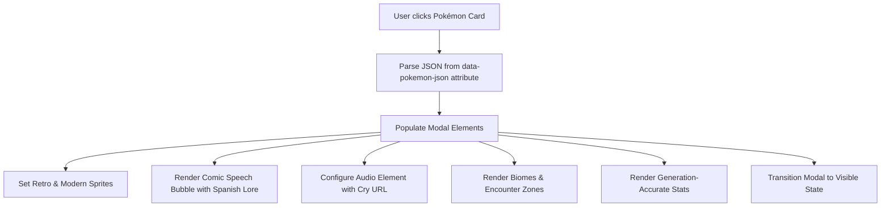

# 🎨 UI & Comic-Book Component Design (English)

## 1. Visual Aesthetics & Design Philosophy

The frontend of **Pokédex Global Tracker** delivers an engaging, tactile experience that blends **vintage comic-book/manga aesthetics** with modern responsive web standards.

Key visual elements include:
- **Hard Solid Shadows**: Custom CSS shadows with no blur (`box-shadow: 7px 7px 0px 0px #0f172a;`), emulating printed ink lines.
- **Ben-Day Dots**: Micro-dot background textures (`.comic-dots`) reminiscent of classic comic printing presses.
- **Speech Bubbles**: Dynamic comic dialog callouts (`.comic-bubble`) that wrap Pokémon flavor texts.
- **Pixel-Art Sharpness**: `image-rendering: pixelated;` applied to classic sprites to preserve authentic Game Boy raster lines on high-DPI retina displays.
- **Game-Themed Color Palettes**: Red, Blue, Yellow, Gold, Silver, and Emerald accent gradients that adapt based on the selected game version.

---

## 2. Interactive Modal Architecture

When a user clicks any Pokémon card on the grid, a high-detail modal window opens without triggering a page reload.

### 2.1 Audio Engine & Cry Playback
The modal integrates an HTML5 `<audio>` player wired to the Pokémon's cry:
- For **Retro Games (Generations 1–5)**: The audio source points to the vintage 8-bit chiptune cry (`legacy` sound file from PokeAPI).
- For **Modern Games (Generations 6+)**: The audio source points to the modern re-recorded 3D sound effects (`latest` cry).
- An interactive sound-wave button allows users to replay the cry at any time.

### 2.2 Dual-Sprite Toggle
Users can seamlessly toggle between:
1. **Game Boy / DS Vintage Sprite**: The exact in-game sprite from that generation.
2. **Modern Official Artwork**: Clean high-resolution vector artwork.

---

## 3. Real-Time Filtering & Search

The grid view features client-side instantaneous filtering:
1. **Search Input**: Live filtering matching Pokémon display name, English name, or 3-digit entry number (e.g. `025` or `Pikachu`).
2. **Elemental Type Filter**: Dropdown allowing users to isolate single or dual-type Pokémon.
3. **Capture Status Filter**: Toggle between "All Pokémon", "Caught Only", and "Uncaught Only".

---

## 4. Responsive Layout Breakpoints

- **Mobile Viewports (`< 640px`)**: Single-column or 2-column card layout, sticky mobile summary footer showing current catch count and percentage.
- **Tablet Viewports (`640px - 1024px`)**: 3-column card grid with expandable filters.
- **Desktop Viewports (`> 1024px`)**: 4-column to 5-column comic grid with sticky navigation bar and full-screen modal overlays.
