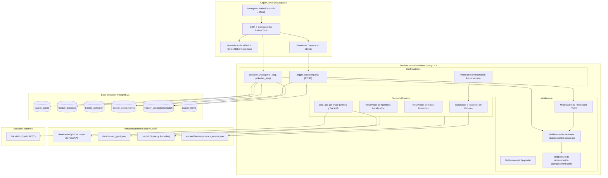
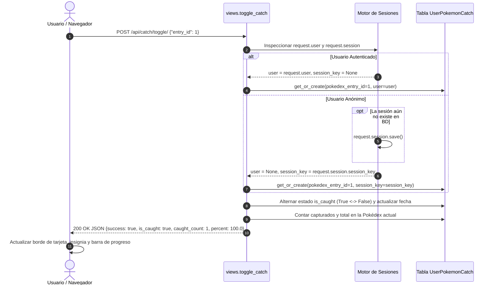

# 🏛️ Arquitectura y Diseño del Sistema (Español)

## 1. Visión General del Sistema

**Pokédex Global Tracker** está estructurado como una aplicación Django modular orientada a un rendimiento de lectura óptimo, alta resiliencia en la ingesta de datos externos mediante una filosofía *Offline-First* y una experiencia de usuario interactiva y fluida.

El proyecto se divide en las siguientes capas lógicas:

1. **Capa de Presentación (Frontend)**: Plantillas HTML5 semánticas estilizadas con Tailwind CSS y clases CSS personalizadas para emular una estética de cómic vintage. El estado en el cliente se gestiona mediante JavaScript nativo utilizando la API Fetch y la API de Audio HTML5.
2. **Capa de Aplicación y Enrutamiento**: El enrutador de Django dirige las peticiones hacia vistas funcionales (`pokedex_view`) y endpoints de API JSON (`toggle_catch`).
3. **Capa de Dominio y Persistencia**: Modelos del ORM de Django conectados a PostgreSQL con campos `JSONField` nativos para metadatos flexibles.
4. **Capa de Ingesta y Comandos CLI**: Procesos multihilo con limitación de tasa (*rate limiting*) que descargan, normalizan y almacenan la información de PokeAPI v2 en caché local y tablas de base de datos.

---

## 2. Diagrama de Arquitectura de Componentes

---

## 3. Ciclo de Vida del Seguimiento de Capturas

### 3.1 Identidad Dual de Usuario (Invitado vs Registrado)
El sistema permite que cualquier visitante marque capturas de inmediato sin forzar un registro obligatorio, conservando sus datos entre recargas gracias a las sesiones de Django:

### 3.2 Estrategia Offline-First en la Ingesta
Para evitar bloqueos por parte de Cloudflare o límites de tasa de PokeAPI, las operaciones de descarga siguen un patrón de verificación previa en almacenamiento local:
1. **Caché Local de Respuestas**: Las peticiones se guardan como archivos JSON en `tracker/data/cache/`.
2. **Control de Tasa y Retroceso Exponencial**: La función `safe_api_get` incorpora retardos voluntarios (0.05s), procesa la cabecera `Retry-After` ante códigos HTTP 429 y aplica un algoritmo de backoff exponencial con variación aleatoria (*jitter*).
3. **Protección de Modificaciones Manuales**: El atributo `is_custom_override` en `PokedexEntry` garantiza que cualquier edición personalizada realizada por un administrador nunca sea pisada por ejecuciones automáticas de comandos CLI.

---

## 4. Optimizaciones Clave de Rendimiento

1. **Eliminación del Problema $N+1$**: En `pokedex_view`, las entradas se obtienen con `.select_related("pokemon")`.
2. **Búsqueda en Memoria $O(1)$ con Sets**: Los identificadores de Pokémon capturados por el usuario se cargan en una sola consulta plana (`values_list('pokedex_entry_id', flat=True)`) y se convierten en un conjunto (`set`), permitiendo comprobar el estado de cada tarjeta en tiempo constante $O(1)$.
3. **Indexación en Base de Datos**: Índices compuestos en `[pokedex, entry_number]`, `[user, pokedex_entry]` y `[session_key, pokedex_entry]` para consultas instantáneas.
