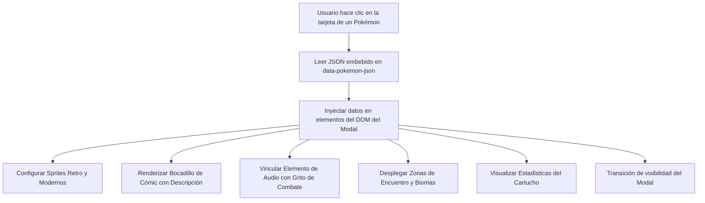

# 🎨 Diseño de Interfaz Estilo Cómic y Componentes (Español)

## 1. Estética Visual y Filosofía de Diseño

El diseño visual de **Pokédex Global Tracker** combina la nostalgia de las historietas y mangas clásicos con componentes web modernos y responsivos.

### Elementos Gráficos Distintivos:
- **Sombras Sólidas y Trazos Fuertes**: Sombras CSS con desplazamiento sin desenfoque (`box-shadow: 7px 7px 0px 0px #0f172a;`), simulando la tinta de imprenta de cómic.
- **Trama de Puntos Ben-Day**: Fondos decorativos con micro-patrones de puntos (`.comic-dots`) inspirados en el fotograbado tradicional.
- **Bocadillos de Diálogo**: Globos de texto dinámicos (`.comic-bubble`) donde se presentan los textos descriptivos oficiales de la Pokédex.
- **Renderizado Nítido de Píxeles**: Aplicación de `image-rendering: pixelated;` en sprites retro para garantizar nitidez total en pantallas de alta resolución.
- **Gradientes Adaptativos por Edición**: Temas de color contextuales según el juego seleccionado (Rojo, Azul, Amarillo, Oro, Plata, Cristal, etc.).

---

## 2. Arquitectura del Modal Interactivo

Al hacer clic en cualquier tarjeta de la cuadrícula, se abre una ventana modal ilustrada sin necesidad de recargar la página.

### 2.1 Motor de Audio y Gritos de Combate
El modal cuenta con un reproductor `<audio>` nativo conectado al archivo sonoro oficial:
- **Generaciones Retro (1 a 5)**: Emite el grito vintage chiptune en 8 bits correspondiente al hardware clásico.
- **Generaciones Modernas (6 a 9)**: Emite los gritos actualizados y orquestados de la era 3D.
- Botón interactivo con ondas sonoras para volver a reproducir el grito en cualquier momento.

### 2.2 Alternador de Sprites Históricos
El usuario puede cambiar instantáneamente entre el sprite pixel-art original de la generación correspondiente y el arte vectorial moderno oficial.

---

## 3. Filtrado y Búsqueda en Tiempo Real

La vista principal incluye controles reactivos en el lado del cliente:
1. **Buscador Reactivo**: Filtro por nombre en español, nombre en inglés o número regional de 3 dígitos (ej: `025` o `Pikachu`).
2. **Selector de Tipos Elementales**: Desplegable que aísla Pokémon de tipo Fuego, Agua, Planta, Dragón, etc.
3. **Filtro de Estado de Captura**: Botones de conmutación entre "Todos", "Solo Capturados" y "Solo Pendientes".

---

## 4. Diseño Responsivo y Puntos de Quiebre

- **Dispositivos Móviles (`< 640px`)**: Cuadrícula de 1 o 2 columnas, con barra fija inferior (*sticky footer*) que muestra el total de capturados y el porcentaje global.
- **Tablets (`640px - 1024px`)**: Cuadrícula de 3 columnas con filtros colapsables.
- **Escritorios (`> 1024px`)**: Cuadrícula de 4 a 5 columnas con selector de juegos fijo en la cabecera y modal expansivo centrado.
