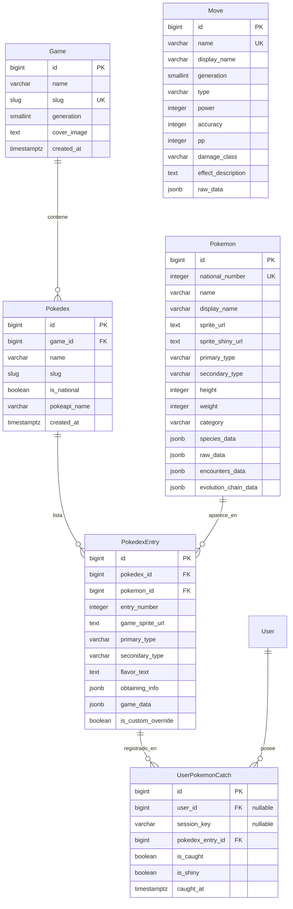

# 🗄️ Modelos de Base de Datos y Esquemas (Español)

## 1. Diagrama Entidad-Relación

---

## 2. Especificación Detallada de Modelos

### 2.1 `Game` (Juego)
Representa un título oficial de la franquicia Pokémon.

- **Nombre de Tabla**: `tracker_game`
- **Campos**:
  - `id`: Clave primaria autoincremental.
  - `name`: Nombre en inglés/oficial (ej: `"Pokémon Red"`).
  - `slug`: Identificador URL único (ej: `"red"`, `"blue"`, `"firered"`).
  - `generation`: Número entero de la generación (del 1 al 9).
  - `cover_image`: URL de la carátula o ilustración del juego.
  - `created_at`: Marca temporal de creación.
- **Propiedades Clave**:
  - `display_name`: Resuelve el nombre en español mediante cascada: mapeo `GAME_NAMES_ES` -> `name` -> PokeAPI version localized text -> slug formateado.
  - `has_retro_sprites`: Devuelve `True` si `generation <= 5` (indica uso de sprites 2D en lugar de modelos 3D).

---

### 2.2 `Pokedex` (Pokédex)
Representa una lista o registro dentro de un juego particular (Pokédex Regional de Kanto, Pokédex de Johto, Pokédex Nacional).

- **Nombre de Tabla**: `tracker_pokedex`
- **Campos**:
  - `id`: Clave primaria.
  - `game`: Clave foránea a `Game` (`on_delete=CASCADE`, relación `pokedexes`).
  - `name`: Nombre descriptivo (ej: `"Pokédex Regional de Kanto"`).
  - `slug`: Slug identificador dentro del juego (`kanto`, `national`).
  - `is_national`: Booleano que indica si abarca la lista universal.
  - `pokeapi_name`: Identificador del recurso en PokeAPI (ej: `"kanto"`, `"original-sinnoh"`).
  - `created_at`: Marca de tiempo.
- **Restricciones**:
  - `unique_together = ('game', 'slug')`.

---

### 2.3 `Pokemon` (Especie Pokémon)
Representa una especie biológica en la Pokédex Nacional universal.

- **Nombre de Tabla**: `tracker_pokemon`
- **Campos**:
  - `id`: Clave primaria.
  - `national_number`: Número nacional único con índice (`1` para Bulbasaur, etc.).
  - `name`: Slug en minúsculas (`"bulbasaur"`).
  - `display_name`: Nombre visible formateado (`"Bulbasaur"`).
  - `sprite_url`: URL al arte oficial o sprite estándar.
  - `sprite_shiny_url`: URL al sprite en versión variocolor (*shiny*).
  - `primary_type`: Tipo primario canónico moderno (`"grass"`).
  - `secondary_type`: Tipo secundario canónico moderno (nulable, `"poison"`).
  - `height`: Altura en decímetros.
  - `weight`: Peso en hectogramos.
  - `category`: Género o categoría en español (ej: `"Pokémon Semilla"`).
  - `species_data`: JSONField con el payload crudo de `pokemon-species` de PokeAPI.
  - `raw_data`: JSONField con el payload crudo de `pokemon` (incluye gritos, movimientos, etc.).
  - `encounters_data`: JSONField con datos crudos de zonas de encuentro.
  - `evolution_chain_data`: JSONField con la cadena evolutiva completa.
- **Propiedades Clave**:
  - `primary_type_es`: Nombre del tipo primario traducido al español.
  - `secondary_type_es`: Nombre del tipo secundario traducido al español.
  - `cry_legacy_url`: URL al grito retro en 8 bits.

---

### 2.4 `PokedexEntry` (Entrada de Pokédex)
Entrada contextual de una especie dentro de un juego y Pokédex específicos. Modela las particularidades de la época y cartucho.

- **Nombre de Tabla**: `tracker_pokedexentry`
- **Campos**:
  - `id`: Clave primaria.
  - `pokedex`: Clave foránea a `Pokedex` (relación `entries`).
  - `pokemon`: Clave foránea a `Pokemon` (relación `pokedex_appearances`).
  - `entry_number`: Número de orden dentro de esta Pokédex regional.
  - `game_sprite_url`: Sprite fiel a la época del juego.
  - `primary_type`: Tipo primario correspondiente a la generación del juego.
  - `secondary_type`: Tipo secundario correspondiente a la generación del juego.
  - `flavor_text`: Descripción de Pokédex oficial en español de ese juego.
  - `obtaining_info`: JSONField con zonas de captura, evolución o intercambios en este cartucho.
  - `game_data`: JSONField con estadísticas históricas y movimientos aprendidos por nivel.
  - `is_custom_override`: Booleano que protege modificaciones manuales realizadas desde el panel de administración.
- **Restricciones e Índices**:
  - `unique_together = ('pokedex', 'entry_number')`.
  - Índice compuesto en `['pokedex', 'entry_number']`.
- **Propiedades Clave**:
  - `primary_type_display` y `secondary_type_display`: Devuelven el tipo histórico de la generación si existe.
  - `cry_url`: Entrega el grito en 8 bits si la generación es $\le 5$ o el audio moderno si es $\ge 6$.
  - `modal_data_json`: Serialización JSON completa para poblar el modal estilo cómic en el navegador.

---

### 2.5 `UserPokemonCatch` (Captura de Usuario)
Registro individual del estado de captura de un usuario sobre una entrada.

- **Nombre de Tabla**: `tracker_userpokemoncatch`
- **Campos**:
  - `id`: Clave primaria.
  - `user`: Clave foránea a `auth.User` (nulable, relación `catches`).
  - `session_key`: CharField(50) con la clave de sesión anónima de Django (nulable, indexado).
  - `pokedex_entry`: Clave foránea a `PokedexEntry` (relación `user_catches`).
  - `is_caught`: Booleano (`True` = capturado, `False` = pendiente).
  - `is_shiny`: Booleano de captura variocolor.
  - `caught_at`: Fecha y hora en que se marcó la captura.
- **Índices**:
  - Compuesto en `['user', 'pokedex_entry']`.
  - Compuesto en `['session_key', 'pokedex_entry']`.

---

### 2.6 `Move` (Movimiento)
Catálogo oficial de ataques y técnicas de combate.

- **Nombre de Tabla**: `tracker_move`
- **Campos**:
  - `id`: Clave primaria.
  - `name`: Slug identificador en inglés (`"thunderbolt"`), único e indexado.
  - `display_name`: Nombre oficial traducido al español (`"Rayo"`).
  - `generation`: Generación de debut (1 al 9).
  - `type`: Tipo elemental (`"electric"`).
  - `power`: Potencia base de daño (nulable en movimientos de estado).
  - `accuracy`: Precisión porcentual.
  - `pp`: Puntos de Poder base.
  - `damage_class`: Clase de daño (`"physical"`, `"special"`, `"status"`).
  - `effect_description`: Descripción oficial del efecto en español.
  - `raw_data`: Estructura JSON completa de PokeAPI.
